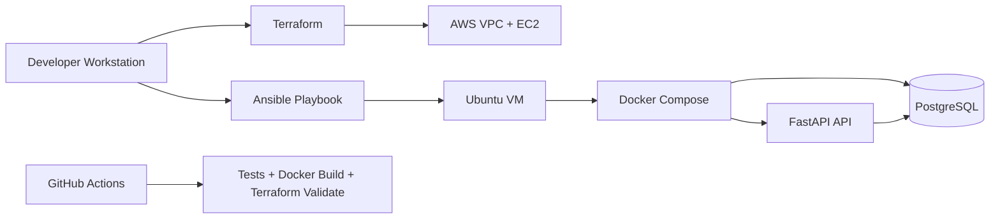

# Cloud Deployment Automation with Terraform and Ansible

A complete DevOps portfolio project that provisions cloud infrastructure with Terraform, configures a Linux server with Ansible, and deploys a containerized FastAPI application backed by PostgreSQL.

## Project Description

This project demonstrates an end-to-end cloud deployment workflow:

- Terraform creates AWS infrastructure: VPC, public subnet, internet gateway, route table, security group, and EC2 virtual machine.
- Ansible configures the Linux server, installs Docker, copies the application, renders environment configuration, starts Docker Compose, and validates the health endpoint.
- Docker Compose runs a FastAPI backend and PostgreSQL database.
- GitHub Actions validates the application, Docker build, and Terraform configuration.

The result is a practical infrastructure-as-code project suitable for a DevOps portfolio, resume, or interview demo.

## Architecture



## Repository Structure

```text
.
├── .github/workflows/ci.yml
├── ansible/
│   ├── ansible.cfg
│   ├── group_vars/app_servers.yml
│   ├── inventory.ini.example
│   ├── playbook.yml
│   └── templates/app.env.j2
├── app/
│   ├── Dockerfile
│   ├── docker-compose.yml
│   ├── main.py
│   ├── requirements.txt
│   └── tests/test_main.py
├── terraform/
│   ├── main.tf
│   ├── outputs.tf
│   ├── terraform.tfvars.example
│   └── variables.tf
├── .gitignore
├── LICENSE
└── README.md
```

## Prerequisites

- AWS account
- AWS CLI configured with credentials
- Terraform 1.6+
- Ansible 2.14+
- Existing AWS EC2 key pair
- SSH private key available locally
- Docker, only for local app testing

## 1. Configure Terraform

Copy the example variables file:

```bash
cd terraform
cp terraform.tfvars.example terraform.tfvars
```

Edit `terraform.tfvars`:

```hcl
project_name     = "devops-portfolio"
aws_region       = "us-east-1"
instance_type    = "t2.micro"
key_pair_name    = "your-existing-aws-keypair-name"
allowed_ssh_cidr = "YOUR_PUBLIC_IP/32"
allowed_app_cidr = "0.0.0.0/0"
```

Use your current public IP for `allowed_ssh_cidr` so SSH is not open to the whole internet.

## 2. Provision Infrastructure

```bash
terraform init
terraform fmt
terraform validate
terraform plan
terraform apply
```

After apply completes, note these outputs:

- `instance_public_ip`
- `application_url`
- `ansible_inventory_line`

## 3. Configure Ansible Inventory

Create an inventory file from the example:

```bash
cd ../ansible
cp inventory.ini.example inventory.ini
```

Replace the placeholder values:

```ini
[app_servers]
app ansible_host=EC2_PUBLIC_IP ansible_user=ubuntu ansible_ssh_private_key_file=~/.ssh/your-key.pem
```

Make sure your private key has safe permissions:

```bash
chmod 400 ~/.ssh/your-key.pem
```

## 4. Deploy the Application

From the `ansible` directory:

```bash
ansible-playbook playbook.yml
```

When the playbook finishes, open:

```text
http://EC2_PUBLIC_IP:8000
```

Useful endpoints:

- `GET /`
- `GET /health`
- `GET /docs`
- `POST /messages`
- `GET /messages`

Example API call:

```bash
curl -X POST http://EC2_PUBLIC_IP:8000/messages \
  -H "Content-Type: application/json" \
  -d '{"text":"deployed with Terraform and Ansible"}'
```

## Local Development

Run the app locally with Docker Compose:

```bash
cd app
cp .env.example .env
```

Start the stack:

```bash
docker compose up --build
```

Open:

```text
http://localhost:8000/docs
```

## CI Pipeline

GitHub Actions runs:

- FastAPI tests
- Docker image build
- Terraform format check
- Terraform validation

Workflow file:

```text
.github/workflows/ci.yml
```

## Cleanup

Destroy AWS resources when you are done:

```bash
cd terraform
terraform destroy
```

## Resume Description

Cloud Deployment Automation using Terraform and Ansible

- Built a DevOps portfolio project demonstrating infrastructure-as-code, Linux server configuration, and containerized application deployment.
- Used Terraform to define AWS infrastructure components including VPC, subnet, security rules, EC2 VM, SSH access, and deployment outputs.
- Developed Ansible playbooks to automate Docker installation, application setup, environment configuration, Docker Compose deployment, and health-check validation.
- Containerized a FastAPI backend with PostgreSQL using Docker Compose and added GitHub Actions for automated testing, Docker builds, and Terraform validation.
